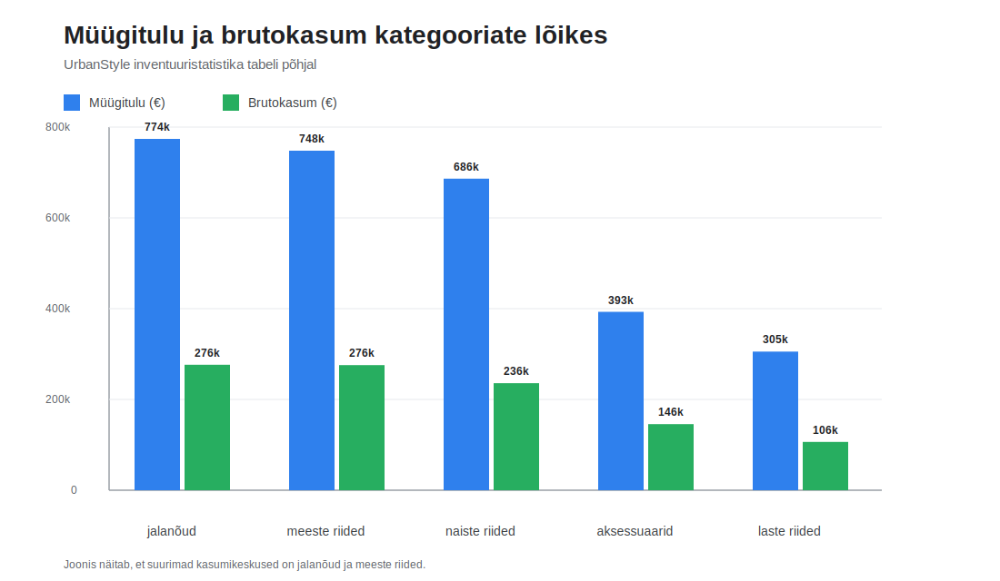
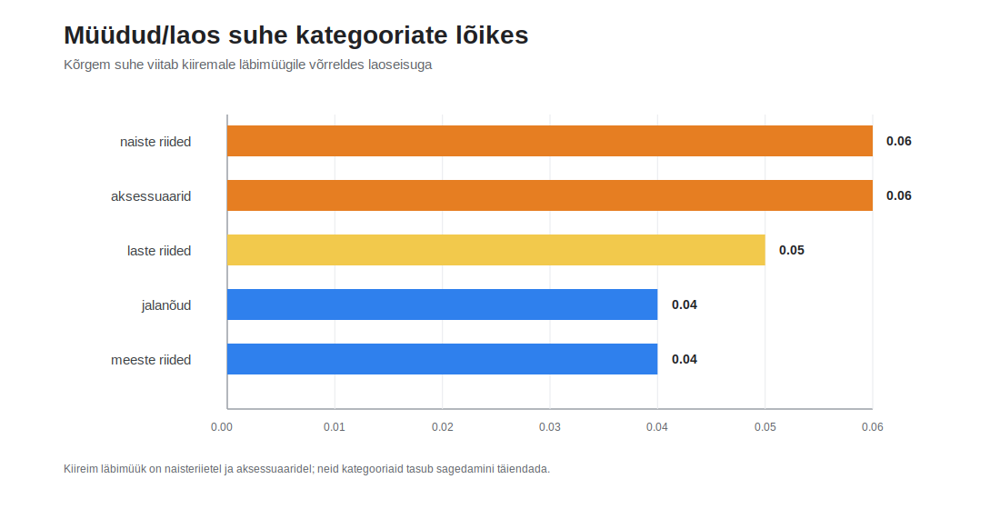
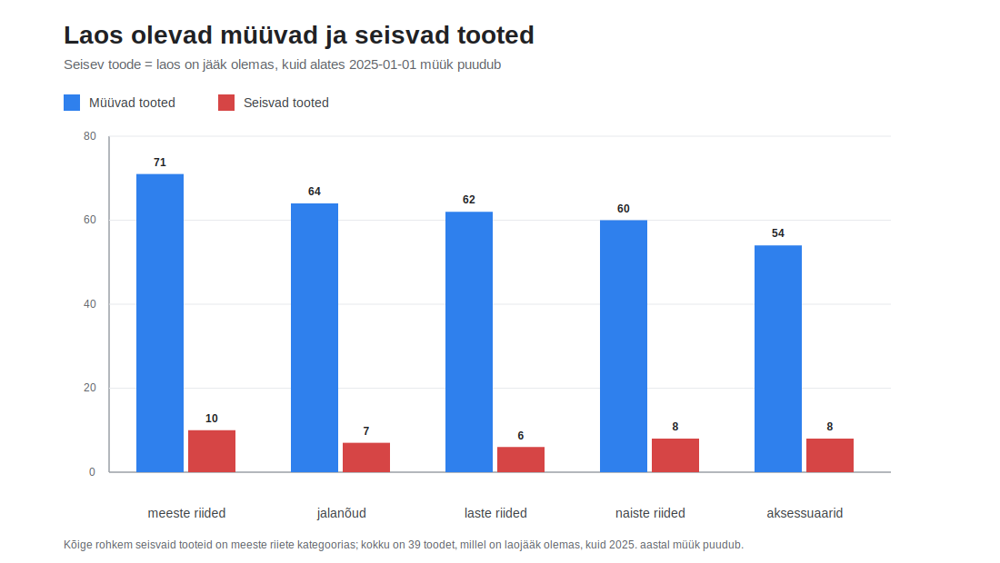

# Week 4 roll C: inventuuristatistika kokkuvõte

Kõige kasumlikumad kategooriad on jalanõud ja meeste riided, sest nende brutokasum on andmete põhjal kõige kõrgem ning nad toovad ka suurima müügitulu. Kõige müüdavamad vs laos suhe on naisteriietel ja aksessuaaridel, mis viitab sellele, et nende kategooriate TOP-toodete saadavust tasub eriti tähelepanelikult jälgida. Kõrget tähelepanu vajavad tooted, mille müüdud/laos suhe on juba väga kõrge, näiteks `Elegantne siidine müts`, `Trendikas goretex chelsea botased` ja `Õhuline polüester cargo püksid`.

Soovitus Annale: hoia naisteriiete ja aksessuaaride laojääki kõrgemal või täienda pidevalt, sest seal liigub kaup laost kiiremini välja. Jalanõusid võiks käsitleda puhta kasumikeskusena: tõsta nähtavust e-poes ja hoia premium-tooted esilehel. Meesteriideid tasub samuti käsitleda tugeva kasumikategooriana, kuid seal tuleb samal ajal aktiivselt vähendada seisvat laovaru, sest osa sortimendist seob raha liiga pikalt lattu. Laste riideid sobib hästi kampaaniate ja komplektmüügi katsetamiseks, sest ühikuid müüakse palju, kuid kogukasum jääb teistest kategooriatest madalamaks; lisaks tasub seal üle vaadata aeglasemalt liikuvad tooted, et laoseis ei kasvaks liiga suureks.

## Laos Seisvad Tooted

Lisasin eraldi laoaruande vaatega, kus `seisvaks` loen toote, millel on laos jääk olemas, kuid millel ei ole olnud müüki alates `2025-01-01`. Selle loogika järgi on laos olevast 350 tootest 311 müüvad ja 39 seisvad; seisva kauba kogujääk on 24 381 ühikut. Kõige rohkem seisvat kaupa on `meeste_riided` kategoorias, kus 10 toodet moodustavad kokku 7527 ühikut, ning seejärel `laste_riided`, kus 6 toodet annavad 7025 ühikut.

Suurimad tähelepanu vajavad seisjad on `Luksuslik orgaaniline dressikomplekt`, `Vintage tweed kampsun` ja `Luksuslik džersii chino püksid`, sest neil on laojääk suur, kuid 2025. aasta müük puudub. See viitab, et nende toodete puhul tasub üle vaadata hinnastus, nähtavus e-poes ja vajadusel teha kampaania või komplektpakkumine, et kaup ei jääks liiga pikalt lattu kinni. Praktiline soovitus on teha meesteriiete ja lasteriiete kategoorias eraldi "laost liikuma" nimekiri, kus kõige suurema jäägiga seisvad tooted saavad esimesena kas hinnaparanduse, kampaania või tugevama esiletõstmise e-poes.

## Diagramm

Allolev tulpdiagramm võrdleb kategooriate kaupa müüdud ühikuid ja laojääki. Kuna laojääk on müüdud kogusest suurusjärgu võrra suurem, on näitajad loetavuse huvides pandud eraldi skaaladele.

Lisaks näitavad järgmised diagrammid, millised kategooriad toovad rohkem tulu ja kasumit ning kus on müüdud/laos suhe kõige kiirem.

